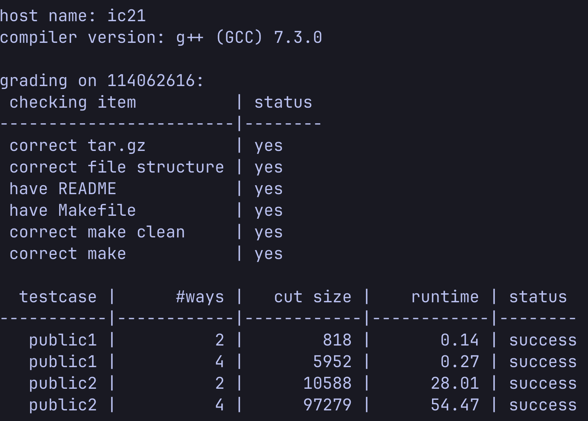

# CS6135 VLSI Physical Design Automation  
## Homework 2: k-way Min-cut Partitioning  
**Student:** 114062616 莊岱倫  
**Date:** 2025-10-26  

---

## Result of `HW2_grading.sh`




---

## Problem Description

In this homework, we implement and modify the **Fiduccia–Mattheyses (FM)** algorithm  
to solve **two-way and four-way min-cut partitioning** problems under balance constraints:

- **2-way balance:** 0.45 ≤ size(G) / size(Total) ≤ 0.55  
- **4-way balance:** 0.225 ≤ size(G) / size(Total) ≤ 0.275  

---

## Implementation Details

### (I) Difference from the FM Algorithm in Class

- **Initialization strategy:**  
  I use a fanout-based ordering to group cells connected by high-fanout nets into the same partition, which helps prevent unnecessary net cuts. This approach provides a significant improvement over my baseline version (which selected cells one at a time). In particular, for public2.txt (2-way), it reduces the cut size by nearly half. 

- **Local → Global Ratio Mapping**

  Before the second split inside P0/P1, convert the global 25% target into local bounds for the current subset, then run the split:
  lower = 0.225 / f, upper = 0.275 / f, with clamping and swapping as needed (see partition_4way() — lower0/upper0, lower1/upper1).

- **Heuristic Global Rebalancing**

  I use a heuristic global rebalancing strategy to correct slight imbalances after the four-way partitioning. Instead of recalculating gains, the algorithm performs lightweight adjustments by moving the smallest feasible cells and applying small-step or pair-swap operations to ensure all partitions remain within the balance window. This approach preserves the overall solution quality while guaranteeing that every partition stays well-balanced.


---

### (II) Bucket List

- **Did you implement a bucket list?**  
  [] Yes   
    I use **only two active bucket lists** .  
    The 4-way result is achieved by **repeatedly applying the 2-way FM pipeline** with its two bucket lists on progressively smaller subsets.
    ```cpp
    struct BucketList {
        int maxGain;
        std::vector<std::vector<Cell*>> buckets;
        std::unordered_map<Cell*, int> gainMap;
        void insert(Cell* c, int g);
        void update(Cell* c, int oldG, int newG);
        Cell* pop_max();
    };

* **Data structure**


    | **Component** | **Type** | **Purpose** |
    |----------------|-----------|-------------|
    | `buckets` | `std::vector<std::vector<Cell*>>` | 2-D container: first dimension = gain index, second = list of cells having that gain |
    | `gainMap` | `std::unordered_map<Cell*, int>` | Fast lookup of a cell’s current gain index (for quick updates) |
    | `maxGain` | `int` | Tracks the current highest non-empty gain bucket |
    | `Cell::isLocked` | `bool` (inside `Cell`) | Marks cells that are already moved and temporarily frozen during this pass |

* **Maintainese**
    - **`maxGain` maintenance**  
      - Updated every time a cell is inserted or removed from a bucket.  
      - When the current max-gain bucket becomes empty, `maxGain` is decremented until the next non-empty bucket is found.  
      > Ensures that `pop_max()` always retrieves the highest available gain cell in O(1) amortized time.

    - **`locked` status (`Cell::isLocked`)**  
      - When a cell is selected as the base cell, it is marked `isLocked = true` so it cannot be moved again in the same pass.  
      - After each pass (or rollback), all selected cells are unlocked using `reset_lock()`.  
      >This prevents duplicate moves and preserves the correctness of the FM gain update process.

    - **Cell–bucket mapping (`gainMap`)**  
      - Each cell’s current bucket index is recorded in `gainMap`.  
      - During gain update:
        1. Find the old index from `gainMap[c]`.  
        2. Remove the cell from `buckets[oldIndex]` (via swap-and-pop to avoid the O(n) data movement of the vector remove).  
        3. Insert it into `buckets[newIndex]` and update `gainMap[c] = newIndex`.  
      > This ensures O(1) access and update for every cell’s position.
### (III) maximum partial and restore the result
* **maximum partial**
    ```c++
    void FM::calc_max_partial_sum() {
    int max = INT_MIN, sum = 0, index = -1;
    for(int i = 0; i < maxGains.size(); i++) {
        sum += maxGains[i];
        if(sum > max) {
            max = sum;
            index = i;
        }
    }
    maxPartialSum = max;
    maxPartialSumIndex = index;
    }
    ```
    This function scans through the list of gain values, accumulates their running sum, and     records the point (index) where the cumulative gain reaches its maximum
    identifying         the best prefix of moves that gives the largest total improvement.
* **restore the result**
    ```c++
    void FM::roll_back_from(int index) {
        for(int i = selectedBaseCells.size() - 1; i >= index; i--) {
            baseCell = selectedBaseCells[i];
            update_cells_gain();
        }
    }
    ```
    This function rolls back all moves made after a given index by iterating backward           through the recorded base cells and calling update_cells_gain() to restore their           previous partition and gain states.
### (IV) How did I modify the FM algorithm to handle four-way min-cut partitioning?
* **Working flow**
  1. First split (2-way, balanced 0.49/0.51).
        Run a local FM bipartition on all cells to get P0 and P1.
	2. Recursive split (each subset → 2-way).
        Run FM again on P0 → (P00,P01) and on P1 → (P10,P11).
	3. Global balance enforcement.
        Adjust the four parts so each holds ~25% of total weight within a tolerance (I use         [22.5%, 27.5%]).
* **Implement detail**

    I implemented the four-way partition using a recursive 2-way FM approach.
    First, I partition the whole set into two balanced subsets (P0, P1) with a ratio of (0.49, 0.51).In each subset is partitioned again using the same FM procedure to form (P00, P01) and (P10, P11).After getting four subsets, I perform a global rebalance to make sure each subset’s total cell size is within [22.5%, 27.5%] of the total.

    The rebalance step simply moves the smallest feasible cell from an oversized partition to an undersized one until all parts are within the range.
    

## What have I learn from this homework
I initially built my implementation based on the lecture slides and used a simple vector-based design for the first version. However, it was too slow to pass the test cases. To address this, I focused on optimizing the bucket list operations and gain updates, since these two parts are called most frequently during each iteration. The adjustments made a significant improvement in runtime performance.

Through this homework, I gained a deep understanding of how cells move between partitions and realized the importance of a good initial partitioning strategy. I experimented with several initialization methods, and the fanout-based approach turned out to be the most effective, giving the best balance and cut-size results.